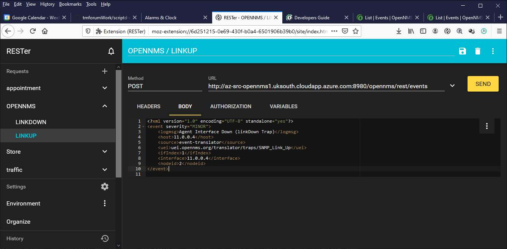

# Testing using Rester

It is possible to inject events into OpenNMS directly using the ReST api documented in the [OpenNMS Developer Guide](https://docs.opennms.org/opennms/branches/latest/guide-development/guide-development.html#_events).

Two typical events for link down and link up are provided here

[opennmsLinkDown.xml](../testScripts/opennmsLinkDown.xml)

[opennmsLinkUp.xml](../testScripts/opennmsLinkUp.xml)

To make things easy you can also import a configuration into the Rester app documented below.

The rester configuration file is [rester-export-postman.json](../testScripts/rester-export-postman.json) and is imported using eh 'organise' panel in rester.

# Rester app
The Rester app is a plugin for firefox or chrome which allows you to create ReST calls.

This folder contains configuration files which can be imported into Rester to make ReST calls to this application

## chrome plugin
https://chrome.google.com/webstore/detail/rester/eejfoncpjfgmeleakejdcanedmefagga?hl=en

## firefox plugin
https://addons.mozilla.org/en-US/firefox/addon/rester/

